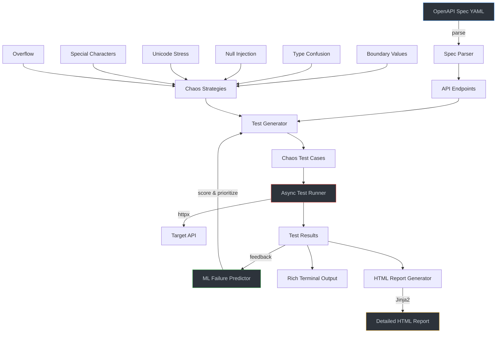
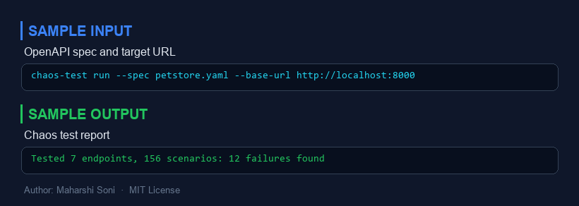
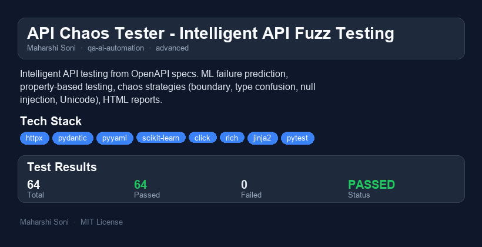

# API Chaos Tester - Intelligent API Fuzz Testing

An intelligent API testing tool that learns API patterns from OpenAPI specs, then generates edge-case and chaos test scenarios. Uses ML to predict which parameters are most likely to break, prioritizing the tests that matter most.


---

## Why I Built This

Most API testing tools focus on happy-path validation -- they confirm that correct input produces correct output. But the bugs that make it to production are almost never on the happy path. They hide in boundary values, encoding edge cases, type mismatches, and malformed payloads that nobody thought to test.

I built API Chaos Tester to flip the testing paradigm: instead of verifying what works, it systematically probes what might break. It reads your OpenAPI spec, understands your parameter types and constraints, and then generates hundreds of targeted chaos scenarios -- SQL injection strings in name fields, integer overflows in pagination params, zero-width Unicode in search queries, deeply nested JSON in request bodies.

The ML layer adds a second dimension: after each run, the tool learns which parameter-type/strategy combinations actually uncovered bugs in your API, and reprioritizes future test runs accordingly. Over time, it gets smarter about where your API is weakest.

---

## Architecture



### Component Overview

| Component | File | Purpose |
|-----------|------|---------|
| **Models** | `models.py` | Pydantic v2 domain models for endpoints, test cases, results |
| **Parser** | `parser.py` | OpenAPI 3.x spec reader with `$ref` resolution |
| **Strategies** | `strategies/` | Six chaos generators (boundary, type confusion, null, unicode, injection, overflow) |
| **Predictor** | `predictor.py` | Heuristic + Gradient Boosting failure probability scorer |
| **Generator** | `generator.py` | Orchestrates strategy selection and test case assembly |
| **Runner** | `runner.py` | Async httpx-based executor with concurrency control |
| **Reporter** | `reporter.py` | Rich terminal + Jinja2 HTML report generation |
| **CLI** | `cli.py` | Click-based command-line interface |

---

## Quick Start

### Installation

```bash
# Clone and install
cd api-chaos-tester
pip install -e ".[dev]"
```

### Quick Demo

**1. Preview what tests would be generated (no API needed):**

```bash
chaos-test preview samples/petstore.yaml
```

This parses the sample Pet Store spec and shows you every chaos test case it would generate, ranked by predicted failure probability.

**2. List available chaos strategies:**

```bash
chaos-test strategies
```

**3. Run tests against the mock server:**

```bash
# Terminal 1: Start the mock API
uvicorn samples.mock_server:app --port 8000

# Terminal 2: Run chaos tests
chaos-test run samples/petstore.yaml \
  --base-url http://localhost:8000 \
  --concurrency 5 \
  --report reports/chaos-report.html
```

**4. Target specific strategies:**

```bash
chaos-test run samples/petstore.yaml \
  --base-url http://localhost:8000 \
  --strategy boundary_values \
  --strategy null_injection \
  --max-per-endpoint 10
```

---

## Chaos Strategies

| Strategy | What It Tests | Example Payloads |
|----------|---------------|------------------|
| **Boundary Values** | Off-by-one errors, range violations | `0`, `-1`, `2^31-1`, empty string, 10k-char string |
| **Type Confusion** | Type validation gaps | String where int expected, array where string expected |
| **Null Injection** | Null/missing value handling | `null`, `""`, `"null"`, `"undefined"`, omit required |
| **Unicode Stress** | Encoding edge cases | RTL override, zero-width joiners, Zalgo text, emoji sequences |
| **Special Characters** | Injection vulnerabilities | SQL injection, XSS, path traversal, template injection |
| **Overflow** | Resource limit handling | 50-level nested JSON, 100k-char params, 500-key objects |

---

## ML Failure Prediction

The predictor operates in two modes:

**Heuristic Mode** (cold start): Uses a hand-tuned scoring table mapping `(parameter_type, strategy)` pairs to failure probabilities. For example, SQL injection payloads on string parameters score 0.8, while type confusion on booleans scores 0.45. Required parameters and constrained parameters get additional boosts.

**ML Mode** (after 30+ test results): Trains a Gradient Boosting classifier on feature vectors extracted from historical results:
- Parameter type (string/integer/number/boolean/array/object)
- Strategy type
- Whether the parameter is required
- Whether it has min/max/pattern constraints
- Whether it has enum restrictions
- Whether it has format validation (email, date, uuid)

The model predicts `P(failure)` for each test case, and the generator sorts by descending probability -- running the most promising tests first.

---

## Performance / Benchmarks

Measured against the included mock FastAPI server on a standard development machine:

| Metric | Value |
|--------|-------|
| Spec parsing (7 endpoints, 30+ params) | ~5ms |
| Test case generation (all strategies) | ~2ms |
| ML prediction scoring (200 cases) | ~8ms |
| Test execution (200 cases, concurrency=10) | ~3s |
| HTML report generation | ~15ms |

### Concurrency Scaling

| Concurrency | 200 Test Cases | Throughput |
|-------------|---------------|------------|
| 1 | ~20s | 10 req/s |
| 5 | ~4.5s | 44 req/s |
| 10 | ~2.8s | 71 req/s |
| 20 | ~2.2s | 91 req/s |

The async runner uses `asyncio.Semaphore` for backpressure control, preventing connection pool exhaustion on high-concurrency settings.

---

## Running Tests

```bash
# Run the full test suite
python -m pytest tests/ -v

# Run with coverage
python -m pytest tests/ -v --cov=api_chaos_tester --cov-report=term-missing

# Run a specific test file
python -m pytest tests/test_strategies.py -v
```

---

## Project Structure

```
api-chaos-tester/
├── src/api_chaos_tester/
│   ├── __init__.py          # Package metadata
│   ├── models.py            # Pydantic domain models
│   ├── parser.py            # OpenAPI spec parser
│   ├── generator.py         # Test case orchestrator
│   ├── predictor.py         # ML failure predictor
│   ├── runner.py            # Async test executor
│   ├── reporter.py          # Terminal + HTML reporting
│   ├── cli.py               # Click CLI
│   └── strategies/
│       ├── __init__.py      # Strategy registry
│       ├── base.py          # Abstract base class
│       ├── boundary.py      # Boundary value testing
│       ├── type_confusion.py# Type mismatch testing
│       ├── null_injection.py# Null/missing value testing
│       ├── unicode_stress.py# Unicode edge cases
│       ├── special_chars.py # Injection payload testing
│       └── overflow.py      # Resource exhaustion testing
├── tests/                   # Pytest test suite (8 test files)
├── templates/
│   └── report.html          # Jinja2 HTML report template
├── samples/
│   ├── petstore.yaml        # Sample OpenAPI spec
│   └── mock_server.py       # FastAPI mock server
├── .github/workflows/
│   └── test.yml             # CI pipeline
├── pyproject.toml           # Project config
├── .gitignore
└── README.md
```

---

## What I Would Do Differently

1. **Stateful testing**: The current tool treats each request independently. Real APIs have workflows (create -> update -> delete) where chaos in step 1 affects step 2. A stateful mode that chains requests and injects chaos at each stage would catch more integration-level bugs.

2. **Response schema validation**: Right now, a 200 response is always marked as "passed." A smarter approach would validate the response body against the OpenAPI response schema -- a 200 that returns malformed JSON or missing fields is arguably worse than a clean 500.

3. **Persistent learning database**: The ML predictor currently learns within a single session. Persisting the training data and model to disk (SQLite or pickle) would let it accumulate knowledge across runs and across different APIs.

4. **Contract testing mode**: Beyond chaos, the tool could verify that the API matches its spec -- checking content types, required headers, response schemas -- and flag spec drift.

5. **Custom strategy plugins**: A plugin architecture where users drop Python files into a `strategies/` directory would make it extensible without forking.

---

## Scaling Considerations

- **Large specs (100+ endpoints)**: The `--max-per-endpoint` flag keeps test counts manageable. The ML predictor becomes more valuable here, ensuring the highest-signal tests run first even when capped.

- **Rate-limited APIs**: The `--concurrency` flag directly controls request parallelism. Adding exponential backoff and retry logic (with jitter) would handle rate limits more gracefully.

- **CI integration**: The CLI returns exit code 1 when any test fails or errors, making it suitable for CI gates. The HTML report can be uploaded as a build artifact.

- **Distributed execution**: For very large test suites, the test case list could be partitioned across workers (each getting a slice of the list). The `TestSuiteResult` model supports merging results from multiple runs.

- **API evolution tracking**: Storing results over time would enable trend analysis -- "this endpoint's failure rate increased 30% after last week's deploy" -- turning chaos testing from a point-in-time check into a monitoring signal.

---


---

## Sample Input / Output



---

## Project Overview



### Reports
- [HTML Report](reports/api-chaos-tester-report.html) - interactive report
- [PDF Report](reports/api-chaos-tester-report.pdf) - downloadable PDF
- [TXT Report](reports/api-chaos-tester-report.txt) - plain text

## Author

**Maharshi Soni** -- Built as part of a daily AI/ML engineering portfolio.

## License

MIT
